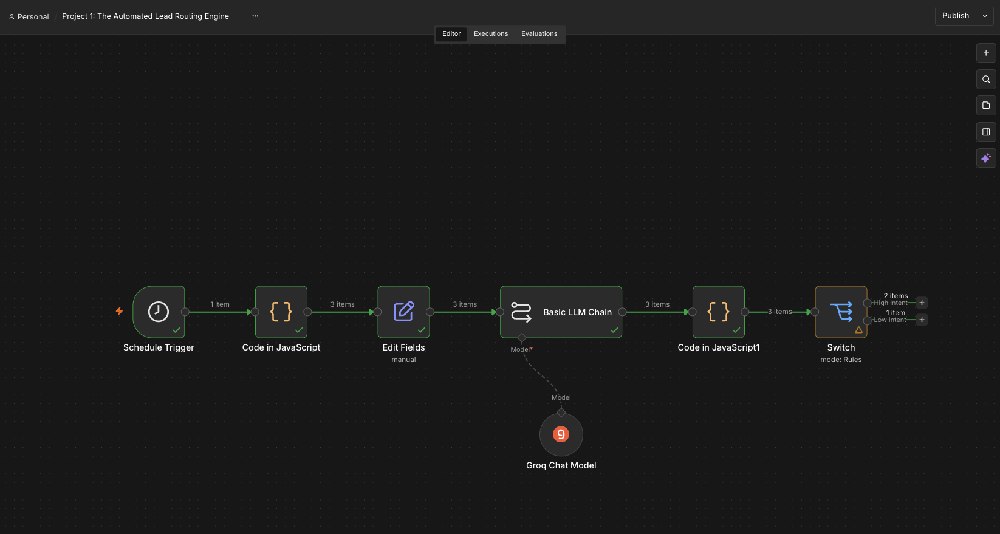
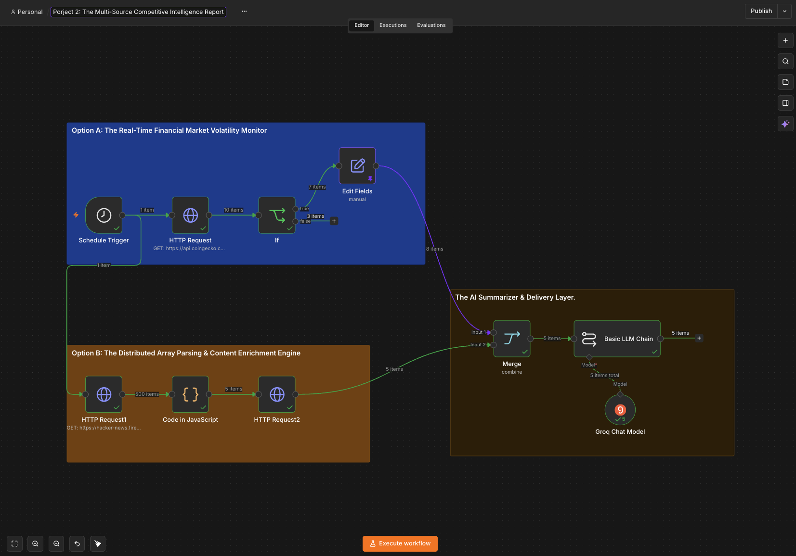

|                                                  Preview                                                   | Project Name                                                                  | Tech Stack                                                                                                                                                                                                                                                                                                                                                                       | Key Deliverable / Focus                                                                                                                                   |                                    Links                                    |
| :--------------------------------------------------------------------------------------------------------: | :---------------------------------------------------------------------------- | :------------------------------------------------------------------------------------------------------------------------------------------------------------------------------------------------------------------------------------------------------------------------------------------------------------------------------------------------------------------------------- | :-------------------------------------------------------------------------------------------------------------------------------------------------------- | :-------------------------------------------------------------------------: |
|                            | **Project 1**  The Automated Lead Routing Engine                | `Orchestration Engine: n8n Workflow Automation (v2.35.7 Self-Hosted)`   `Artificial Intelligence Layer: Groq Cloud API running the Qwen-2.5 LLM infrastructure`   `Framework Architecture: LangChain integration via n8n's Basic LLM Chain and Chat Model nodes`   `Data Processing Language: JavaScript (ES6+)`   `Data Formats: JSON (JavaScript Object Notation)` | `Dynamic Data Transformation`   `Deterministic Routing Implementations`   `State Management & Array Merging`   `Advanced LLM Prompt Engineering` |              [💻 Code](./01-lead-routing-engine/workflow.json)              |
|  | **Project 2**  The Multi-Source Competitive Intelligence Report | `Orchestration Engine: n8n Workflow Automation (v2.35.7 Self-Hosted)`   `Artificial Intelligence Layer: Groq Cloud API running the Qwen-2.5 LLM infrastructure`   `Framework Architecture: LangChain integration via n8n's Basic LLM Chain and Chat Model nodes`   `Data Processing Language: JavaScript (ES6+)`   `Data Formats: JSON (JavaScript Object Notation)` | `Dynamic Data Transformation`   `Deterministic Routing Implementations`   `State Management & Array Merging`   `Advanced LLM Prompt Engineering` | [💻 Code](./02-multi-source-competititve-intelligence-report/workflow.json) |
